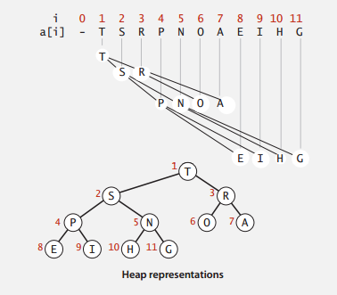
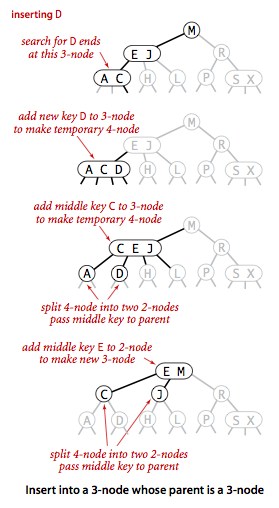
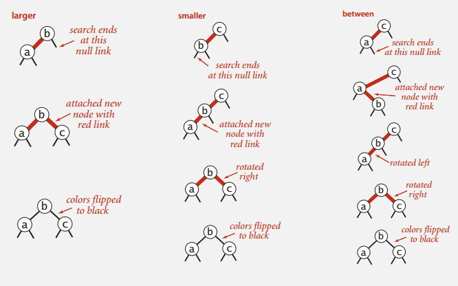

title: Algorithm I Summary
date: 2015-01-10 01:54:07
categories: Algorithm
tags: Algorithm
---

Finally! All the lecture videos of "Algorithm I" Course from Coursera is now finished recently, and I believe now it's a good time to review and summarize.
<!--more-->

All contents are based on Coursera course slides, as well as other helpful sites (Wikipedia, StackOverflow, [Algorithm - 4th Edition](http://algs4.cs.princeton.edu/home/) from Princeton U). All pictures are from the slides and the [Algorithm - 4th Edition](http://algs4.cs.princeton.edu/home/).

## Stacks and Queues

Stacks and Queues are probably the most commonly seen data structures seen in the software. Stacks are "First-In-Last-Out", while Queues are "First-In-First-Out". The basic operations they support are push() and pop().

The underlying implementations could be linked-list, arrays and etc.. Linked list provides with more flexible memory management, constant time operations, but brings more time overhead and memory overhead for the link operations. Arrays on the other hand, brings tricky issues of resizing, but the operations are also constant time, and has less memory overheads.

## Priority Queues and Heaps

### Priority Queues

Although often mentioned together, Priority Queue and Heap are [different concepts](http://en.wikipedia.org/wiki/Priority_queue). Priority Queue is an abstract data type which is like a queue or stack data structure, but is often implemented in heaps, just like lists could be implemented as arrays or linked lists.

Priority Queue, as its name suggests, could give the element with highest priority. Usually it requires O(1) performance for this operation as it's crucial to many applications, to name a few (From course slides):

* Event-driven simulation [give the next event for simulation]
* Graph searching [Dijkstra's Algorithm]
* Data compression
* Statistics [Maintain largest M values]
* Operating Systems [Load balancing, interrupt handling]
* ...

### Heap

Binary Heap is one most common implementation of Priority Heap. It uses a binary tree to maintain the data relationship, and could be implemented with arrays. As shown below. (Picture from slide of [Coursera Algorithm I Course](https://class.coursera.org/algs4partI-006)).



A Binary Heap has the following properties:

* Is a complete binary tree.
* Largest key is root node of binary tree, which is represented as list[1].
* In array representation, the 0 node is often a dummy node, therefore,
* Parent of node k is at k/2.
* Children of node k are at 2k and 2k+1

The following operations are supported by Binary Heap:

* __Insertion__: To insert, add a node at the end, then swim it up. Meaning: keep comparing it with its parent, if larger than parent, then switch position with it.

* __Deletion__: Binary heap supports deletion from the root node (extract the max element). It removes the root node, then replace the root node with the last element on the last level, then sink it. Meaning: keep switching position with the larger one of its children. 

Binary Heaps, both insertion and deletion takes O(logN) time to swim or sink, which makes finding max M elements in N O(MlogN).

For Heap Sort, I'd like to categorize it together with all the sorting algorithms, described as following.

## Sorting Algorithms

## Elementary Sort

The elementary sorting algorithm part introduces __Insertion Sort__, __Selection Sort__, along with __Shell Sort__.

__Selection Sort__: As name suggests, selection sort traverse the unsorted part of the list to find the minimum element, and put it in the front of the unsorted part, and consider this element sorted.

Selection Sort has O(N^2) of average time complexity, even when the list is almost sorted.

__Insertion Sort__: For each element, keep comparing it to the element in front of it and switch position if it's smaller than the front element, until it's the larger one.

It has O(N^2) of average time complexity as well, but only ~N operations when the list is almost sorted, which makes it actually quite useful in certain cases.

__Shell Sort__: The algorithm starts with sorting elements h elements apart with insertion sort, then keep decreasing h to have the list "h-sorted", until h reaches 1, and the whole list is sorted.

With these two gap sequences, Shell Sort is known to have [O(N^3/2) average time complexity](http://www.sorting-algorithms.com/shell-sort), [O(Nlog(N)) time complexity](http://www.sorting-algorithms.com/shell-sort) for nearly sorted lists, which gives it pretty good performance.The value of the gap h is commonly chosen by 3k+1, or an experiment found array of [1, 4, 10, 23, 57, 132, 301, 701]. Also as it doesn't require function calls, it's actually used in many cases such as embedded systems, and Linux kernel.


### Merge Sort

Merge Sort is best described recursively. It takes the following procedures to the list of elements:

* Divide array into two halves.
* Recursively divide and sort each half.
* Merge two halves in order.

One important feature of Merge Sort is that, it takes O(N) of extra memory space. Also, it has so much overhead for tiny subarrays. Therefore, for small sized subarrays, Merge Sort could use Insertion Sort for speed up.

Time complexity for Merge Sort is O(NlogN). It is stable - meaning previously sorted items would not be rearranged by new sorts.

### Quick Sort

The steps for quick sort are as follows:

* Choose an element of the list to be the pivot.
* Put all elements smaller than the pivot to the left, elements larger than the pivot to the right.
* Recursively sort the left and right partition.
* Join the left, pivot, and the right.

Quick Sort, as its name suggests, has the [reputation for the fastest sort](http://rosettacode.org/wiki/Sorting_algorithms/Quicksort). It has O(NlogN) time complexity, although for certain inputs and bad pivot selection (e.g. a sorted list and first element for pivot), the worst case could be O(N^2). Also, for small subarrays, Quick Sort could use Insertion Sort to reduce overhead.

One problem with Quick Sort is that its performance decreases when dealing with lists with many identical elements. This could be solved by a variation: The 3 way Quick Sort, which separates the list into 3 separations of less-than, equal, and larger than.

Quick Sort is known as fast, and is therefore widely used in many system applications.

### Heap Sort

The idea for Heap Sort is to create a heap with all the keys, and repeatedly remove the max key. As described above, when the max value is deleted, the last element replaces the root node, and sunk down to the appropriate place.

One significant feature of Heap Sort is that: it has O(NlogN) worst-case performance. But (From Course Slides):

* Inner loop longer than Quick Sort.
* Cache unfriendly.
* Not stable.

### Summary for Sorting

There is an website introducing the details of different sorting algorithms, with sorting animations: http://www.sorting-algorithms.com/ . The following table summarizes some of the common sorting algorithms.

| Algorithm | Average Time | Worst Time | Extra Space | Adaptive | Stable |
|-----------------------------------|
| Selection Sort | O(N^2) | O(N^2) | O(1) | No | No |
| Insertion Sort | O(N^2) | O(N^2) | O(1) | Yes | Yes |
| Shell Sort | O(N^3/2) | O(N^2) | O(1) | Yes | No |
| Merge Sort | O(NlogN) | O(N^2) | O(N) | No | Yes |
| Quick Sort | O(NlogN) | O(N^2) | O(1) | No | No |
| 3-Way Quick Sort | O(NlogN) | O(N^2) | O(1) | Yes | No |
| Heap Sort | O(NlogN) | O(NlogN) | O(1) | No | No |


## Binary Search Trees

A Binary Search Tree is a Binary Tree in Symmetric Order. Meaning: each node has a key, that's larger than all keys in its left subtree, but smaller than all keys in its right subtree.

__Search__: Searching in Binary Search Tree is intuitive: if search key is less than node, go left, if greater, go right, if equal, search hit.

Search in Binary Tree has average time complexity of O(logN) for N elements.

__Insert__: Inserting in Binary Search Tree is similar to search. It keeps finding in the tree until see NULL node.

Both Search Insertion requires O(logN) of time in average, but could be O(N) in worst case when the tree is unbalanced (e.g. The tree is inserted in sequential order).

__Deletion__: One famous deletion technique for Binary Search Tree is the [Hibbard deletion](http://algs4.cs.princeton.edu/32bst/). As Hibbard deletion describes, when deleting:

* __Node with one child:__ Delete the node and replace it with its child.
* __Node with two children:__
    - Find the node t to delete.
    - Find successor x of t, so that x has no left child (the min in t's right subtree).
    - Put x in t's spot.

See below:


Deletion is said to have O(sqrt(N)) average time complexity (From course slides), but still suffers from performance worsening when the tree is unbalanced. One way to tackle this issue is to use a Balanced Search Tree, as described below.

## Balanced Search Trees

### 2-3 Search Trees

2-3 Tree has the following properties:

* Allow 1 or 2 keys per node.
    - 2-node: 1 key, 2 children.
    - 3-node: 2 keys, 3 children.
* In symmetric order.
* Perfect balance: every path from root to null link has same length.

2-3 Tree is designed to keep the tree perfectly balanced, since all its transformation keeps the tree symmetric.

__Insertion for 2-3 Search Tree:__

* Search and find the node to insert in, as in Binary Search Tree.
* If the node is a 2 node, then insert the key to make it a 3 node.
* If the node is a 3 node, then insert the key to make it a temp 4 node, then:
    - Split the 4 node, percolate the middle node up to the parent.
    - Split the rest 2 keys as two separate 2 nodes.
    - If the parent becomes 4 node, recursively split the parent node in the same way.

As shown below:



The idea for 2-3 Tree is a beautiful idea, but complicated in implementation. So there are variations and derivations of implementations. Red-Black Tree is one of them.

### Red-Black Trees

One variation of Red-Black Tree discussed in the course is called the Left-Leaning Red-Black Tree. (Guibas-Sedgewick 1979 and Sedgewick 2007, and Sedgewick is the instructor of this online course!)

LLRBT uses a red node to represent the glue for 3-nodes in 2-3 Tree. Therefore it has the following properties:

* No node has two red links connected to it.
* Every path from root to null link has the same number of black links. (Because the corresponding 2-3 Tree is balanced.)
* Red links lean left.

To understand the operations in LLRBT, we can build all operations with the following basic operations:

* __Left Rotation:__ Orient a temporarily right-leaning red link to lean left.
    as follows:
    
* __Right Rotation:__ Same as Left Rotation, rotate node to the right.
* __Color Flip:__ If a node has two red children, flip the color of children to black and mark itself red.

And with these basic transformations, we can operate with insertion on the LLRBT, in case of following scenarios:

* __Inserting into a single node__ (A 2 node in 2-3 Tree):
    - __Insert to the left:__ Add to the left, and mark the new node red.
    - __Insert to the right:__ Add to the right, and since there's a right-leaning red link, left rotate its parent node, to make the parent a left-leaning red node.
* __Inserting into a 3 node__:
    - __To the left of a 3 node:__ This makes its parent in the middle of two left leaning red links. Right rotate the parent node, and flip color.
    - __To the center of a 3 node:__ This makes its parent in the middle of a two red links, the parent node is left leaning, and the inserted node is left leaning. Left rotate the parent node, then right flip the inserted node, then flip color.
    - __To the right of a 3 node:__ This makes the parent has two red children, then flip color.

As the graph shows:



Although the operations in each cases look really complicated, the actual code could be made concise and elegant using with recursion. To keep in mind that all these operations are used to guarantee that the tree is fully balanced, and there are no right leaning red links.

The Java example for inserting in LLRBT from the course slide is shown as follows. The insertion searches in the tree for appropriate insert position, and add a new red node at the end. Then determine if the node is violating the properties for LLRBT (Right leaning red node? Two consecutive red links? ...), and operate on the node accordingly.

Code example for LLRBT insertion in Java:

```java
private Node put(Node h, Key key, Value val)
{
    if (h == NULL) return new Node(key, val, RED);
    int cmp = key.compareTo(h.key);
    if      (cmp < 0) h.left = put(h.left, key, val);
    else if (cmp > 0) h.right = put(h.right, key, val);
    else              h.val = val;

    if (isRed(h.right) && !isRed(h.left))    h = rotateLeft(h);
    if (isRed(h.left) && isRed(h.left.left)) h = rotateRight(h);
    if (isRed(h.left) && !isRed(h.right))    flipColors(h);

    return h;
}
```


## Symbol Tables And Hash Tables

The Symbol Table, again, is an abstract data type, which maps from keys to values. It supports operations of insertion, deletion, search by key, and etc.. It's commonly implemented with Hash Tables, which is used everywhere. Some languages have built-in support for Hash Tables.


### Hash Table

Hash Table is a key-indexed table, that maps from its keys to value, and index is a function of the key (hashing function).

The ideal scenario is that the index distributed uniformly in the hashing index, so that the access to each element requires O(1) time. Somehow when there are collisions, there are two ways to resolve collisions.

__Separate Chaining:__ For separate chaining, each collision is stored under the same index, but uses a linked-list to store all the elements under the same index.

__Open Addressing:__ In case of a collision, the Hash Table probes the array for the next available position of inserting. There are more than one way to find the next available slot:

* Linear Probing.
* Quadratic Probing.
* Double Hashing.

While for linear probing, when the array gets too full, the performance for searching and insertion degrades drastically. It keeps relatively good performance when the array is under 50% full.

